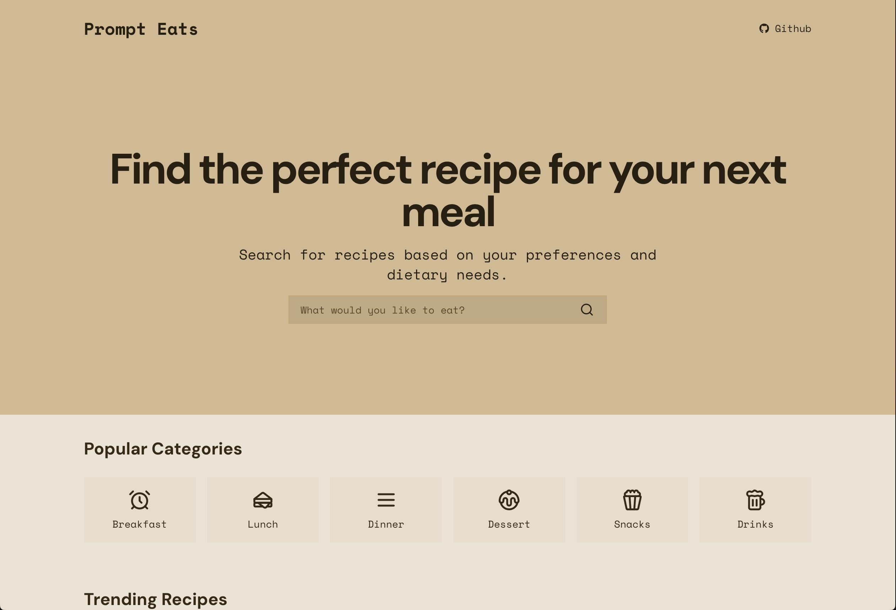
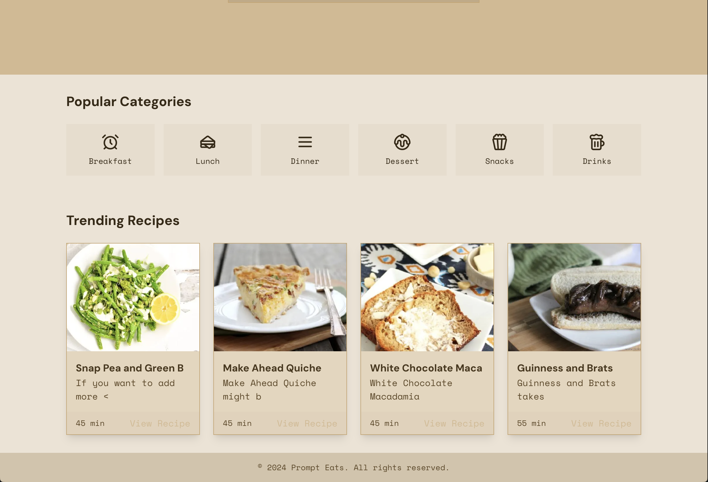

# Prompt Eats



This project is a recipe recommendation application that uses Fluvio, Spoonacular API, Express, and WebSockets to provide live updates of recipes being searched by users. The backend processes search queries and streams recipe data to the frontend, where it is displayed in real-time.

### **Table of Contents**

-   [Demo](#demo)
-   [Installation](#installation)
-   [Usage](#usage)
-   [Features](#features)
-   [Architecture](#architecture)
-   [API Endpoints](#api-endpoints)
-   [WebSocket Integration](#websocket-integration)
-   [Frontend Integration](#frontend-integration)
-   [Clearing Old Data](#clearing-old-data)
-   [Contributing](#contributing)
-   [License](#license)

---

## **Demo

https://github.com/user-attachments/assets/4b9b2f5d-bdf5-4fbd-8758-bcf9f42b0186

### **Installation**

To get started with this project, follow the steps below:

#### **Prerequisites**

-   **Node.js** (v14 or higher)
-   **npm** (v6 or higher)
-   **Fluvio CLI** (Ensure Fluvio is installed and running)

#### **Clone the Repository**

```bash
git clone https://github.com/ChiragAgg5k/prompt-eats
cd prompt-eats
```

#### **Install Dependencies**

```bash
cd frontend
npm install

cd ../backend
npm install
```

#### **Environment Variables**

Create two .env files in the `frontend` and `backend` directories with the following variables:

1. **Frontend:**

```env
NEXT_PUBLIC_BACKEND_URL=http://localhost:8000
```

2. **Backend:**

```env
SPOONACULAR_API_KEY=your_spoonacular_api_key
```

#### **Start the Backend Server**

```bash
cd backend
npm run start # or `nodemon index.ts` for development
```

The backend server will start on `http://localhost:8000`.

#### **Start the Frontend Server**

```bash
cd frontend
npm run dev
```

The frontend server will start on `http://localhost:3000`.

---

### **Features**

-   **Real-Time Recipe Updates:**

    -   Users receive live updates of recipes being searched by others, displayed instantly on the frontend.

-   **Spoonacular API Integration:**

    -   Fetch detailed recipes from the Spoonacular API, including titles, descriptions, images, and preparation time.

-   **WebSocket-Based Streaming:**

    -   Uses WebSockets to push new recipes to connected clients as they are searched.

-   **Fluvio for Streaming Data:**

    -   Leverages Fluvio to stream and manage real-time data efficiently.

-   **Trending Recipes:**
    -   Fetches a list of trending recipes from the Spoonacular API.



---

### **Architecture**

The project is divided into two main components:

1. **Backend (Express + Fluvio):**

    - **Express:** Handles HTTP requests, serves API endpoints, and manages WebSocket connections.
    - **Fluvio:** Manages streaming of recipe data between the backend and frontend.
    - **Spoonacular API:** Fetches recipe data based on user prompts.

2. **Frontend (Nextjs + WebSocket):**
    - **Nextjs:** Displays the list of recipes in real-time as they are received.
    - **WebSocket:** Maintains a persistent connection with the backend to receive live updates.

---

### **API Endpoints**

#### **1. GET `/trending`**

Fetches a list of trending recipes.

-   **Query Parameters:**
    -   None
-   **Response:**
    -   An array of recipe objects with the following fields:
        -   `id`: Recipe ID
        -   `title`: Recipe title (truncated)
        -   `description`: Short description
        -   `image`: Image URL
        -   `readyInMinutes`: Preparation time in minutes
        -   `url`: Link to the full recipe

#### **2. POST `/search`**

Searches for recipes based on a user-provided prompt and streams the results via Fluvio.

-   **Request Body:**
    -   `prompt`: The search query provided by the user.
-   **Response:**
    -   A message indicating that the recipes have been sent to Fluvio.

---

### **WebSocket Integration**

The WebSocket server listens for incoming connections and streams new recipe data as soon as it's available. The WebSocket connection is established on `ws://localhost:3000`.

#### **Client-Side Integration Example (React)**

```javascript
useEffect(() => {
	const ws = new WebSocket("ws://localhost:3000");

	ws.onmessage = (event) => {
		const recipe = JSON.parse(event.data);
		setRecipes((prevRecipes) => [...prevRecipes, recipe]);
	};

	ws.onclose = () => {
		console.log("WebSocket connection closed");
	};

	return () => {
		ws.close();
	};
}, []);
```

---

### **Frontend Integration**

To integrate the backend with the frontend:

1. **Connect to WebSocket:**

    - Establish a WebSocket connection to receive real-time updates.

2. **Render Recipes:**
    - Display the received recipes in a list or any other desired format.

Example frontend code can be found in the `src/App.tsx` file.

---

### **Clearing Old Data**

This project uses `Offset.FromEnd()` to start consuming from the latest offset, effectively skipping all old messages. This ensures that only new messages are processed, keeping the data fresh.

To reset the topic entirely, you can delete and recreate the Fluvio topic:

```bash
fluvio topic delete recipe-stream
fluvio topic create recipe-stream
```

---

### **Contributing**

Contributions are welcome! Please fork the repository and create a pull request with your changes. Ensure that your code follows the established style and passes all tests.

1. **Fork the Repository:**

    - Click on the "Fork" button at the top right of this repository.

2. **Clone the Forked Repository:**

    - `git clone https://github.com/yourusername/real-time-recipe-app.git`

3. **Create a New Branch:**

    - `git checkout -b feature/your-feature-name`

4. **Make Your Changes:**

    - Implement your feature or fix.

5. **Push to Your Fork:**

    - `git push origin feature/your-feature-name`

6. **Create a Pull Request:**
    - Submit a pull request to the main repository for review.

---

### **License**

This project is licensed under the MIT License. See the [LICENSE](LICENSE) file for details.

---

This README should provide a comprehensive guide to setting up, using, and contributing to the project. If you have any questions or need further assistance, feel free to open an issue in the GitHub repository.
